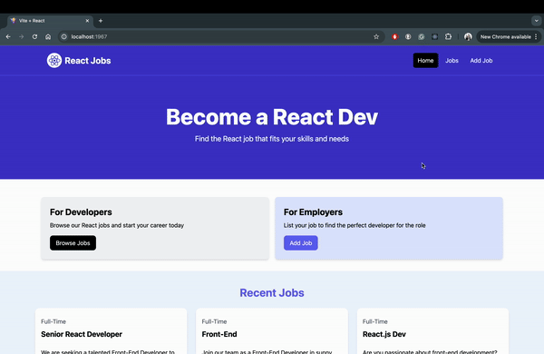

# React Job Listings
This project is a full-stack job listing application built with React and Express. It allows users to browse, add, edit, and delete job listings. The application is designed to provide a seamless experience for both job seekers and employers.

## Features

### Front End
<ul>
  <li>React: The frontend is built using React, providing a dynamic and responsive user interface.</li>
  <li>React Router: Utilizes React Router for client-side routing, enabling smooth navigation between pages.</li>
  <li>State Management: Uses React's useState and useEffect hooks for state management and side effects.</li>
  <li>Components: Modular components such as Navbar, Hero, JobListings, JobPage, AddJobPage, and EditJobPage ensure reusability and maintainability.</li>
  <li>Styling: Tailwind CSS is used for styling, ensuring a modern and responsive design.</li>
  <li>Notifications: React Toastify is integrated for user notifications, providing feedback on actions like adding, updating, or deleting jobs.</li>
</ul>

### Back End 
<ul>
  <li>Express: The backend is powered by Express, handling API requests and serving static files.</li>
  <li>File System: Job data is stored in a JSON file (data/jobs.json), and the backend uses the fs module to read and write this data.</li>
  <li>API Endpoints: Provides RESTful API endpoints for CRUD operations on job listings.</li>
</ul>

## Development Tools
<ul>
  <li>Vite: Used for fast and efficient development and build processes.</li>
  <li>Nodemon: Automatically restarts the server on file changes during development.</li>
  <li>ESLint: Ensures code quality and consistency.</li>
  <li>JSON Server: Provides a quick and easy way to mock a RESTful API for development purposes.</li>
</ul>

## Getting Started
To run the project locally, clone the repository and install the dependencies using npm install. Start the development server with npm run dev and the backend server with npm run start.
This project demonstrates a comprehensive approach to building a full-stack application with modern web development technologies, making it a great starting point for similar projects.

